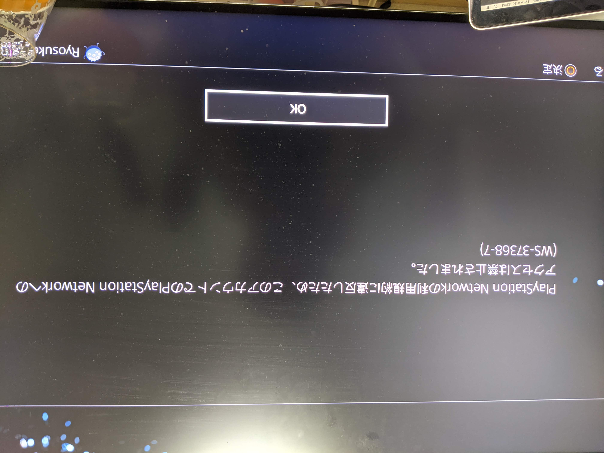
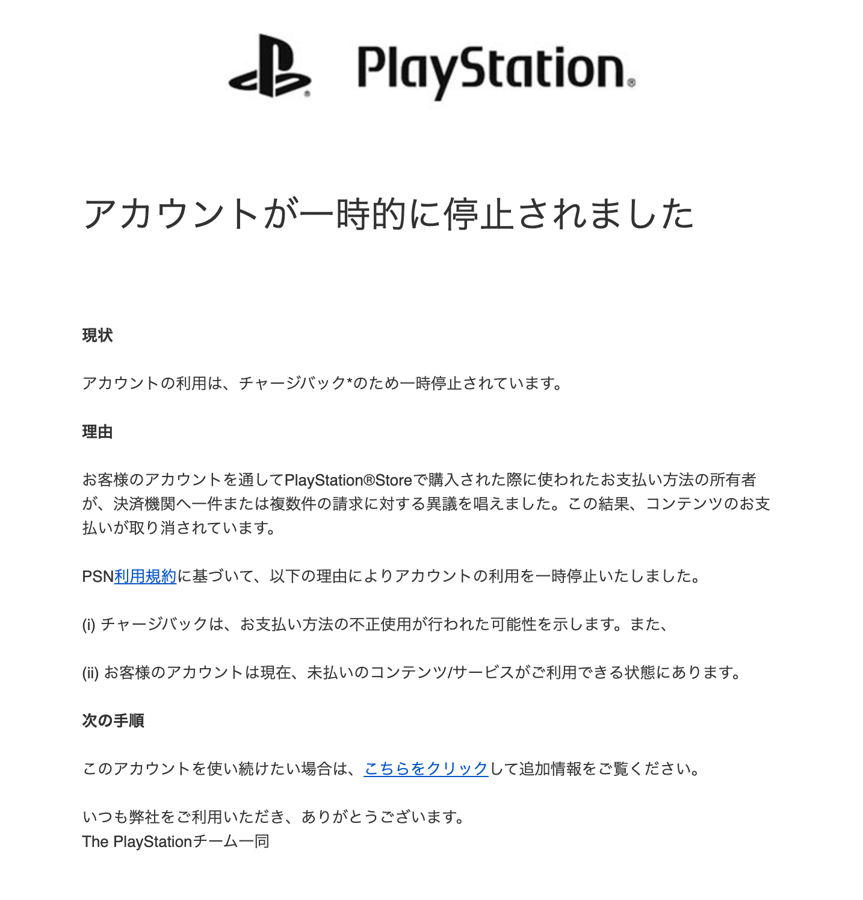
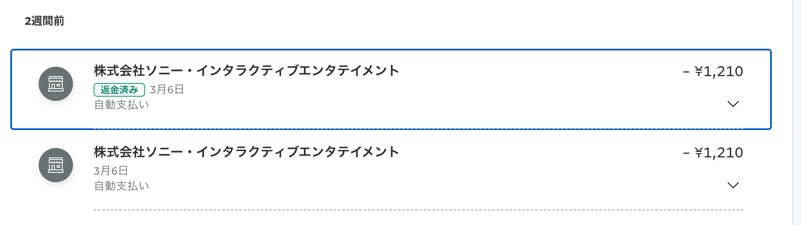

PSN アカウントが凍結されました。何をしたら凍結されたのかを簡単に書いておき、他の人が同じような経験を踏まないことを祈って残しておきます。

# 気づき

いつものように、PS4 を起動して原神を起動したところ、「アカウント未登録」という謎のエラーメッセージとともに原神にログインできなくなりました。
てっきり原神のバグかな？と思い、ゲームの再起動やPS4の再起動を行いましたが全然ログインできません。
よくよく、PS4のメインメニューを見ていると画面下に Playstation Network にサインインしてくれ、というようなメッセージが。
そこでログインしてみると、まさかの「WS-37368-7」という謎のメッセージとともに利用規約に違反したためアクセスは禁止されました。と表示されているではありませんか。

というわけでめでたく垢BANです。本当にありがとうございました。💢😠

# 調べてみる

いやいや待て待て、ということでエラーコードを調べてみます。あんまりまともな情報が出てこないのですがどうやら支払いに問題があり、アカウントが一時的に凍結されているようです。
曰く、メールでアカウント凍結理由がくるので確認して。とのことなのでチェックしてみます。

こんな内容のメールが届いていました。

# アカウントの復活は可能なのか?

ちなみに PlayStation サポートにはアカウントが凍結されると基本的に復活されないようなことが記載されています。

> PSNの利用停止は、PlayStation®Safetyチームの詳細な調査に基づくものです。したがって、次の場合を除いては利用停止が解除されることはありません。
>> 支払取り消しにより利用が停止された場合。お支払いが行われると解除されます。詳細につきましては、[支払い取り消しによるアカウントの利用停止について](https://www.playstation.com/ja-jp/support/account/psn-suspension-account-debt/)をご確認ください。 

- [PlayStation Network の利用停止](https://www.playstation.com/ja-jp/support/account/suspensions-psn/)

今回はこの支払い取り消しにより利用が停止された場合、に該当するのでサポートに問い合わせを行い状況の調査をしてもらうとともに自分でも心当たりを洗います。

# サポートに問い合わせ

PSNサポートは LINE によるチャット対応が行われていました。

簡単に問い合わせ内容とサポートの回答を書きます。

- どうしてアカウント凍結されたの?
    - お前のアカウントで支払いの確認が取れなかったから一時的に止めたわw
- え、これどうすれば解放される?
    - 負債額を全額支払えば1週間以内に解放するよ
    - カード会社に連絡して再度処理してもらってな
- カード会社がそんな処理できないって言ってるんだけどどうすればいい?
    - コンビニに行って、PSNのPOSAカード買ってこい。そしてスクラッチ削って裏のコードをサポートに教えてくれ。

という経緯です。これで一旦は何とかなりそうですが今のところは全く解放される気配はありません。

# 原因

ちなみにどうして支払いの確認が取れない。なんて経緯に至ったか。
これは原神に天空紀行と呼ばれるいわゆるバトルパスがあるのですがそれを購入したあと、二重で PSN から請求が来ていることを PayPal の履歴を見て気づき、PayPal の問題解決センターで[異議を提出した](https://www.paypal.com/jp/smarthelp/article/paypal%E3%81%AE%E7%95%B0%E8%AD%B0%E3%81%8A%E3%82%88%E3%81%B3%E3%82%AF%E3%83%AC%E3%83%BC%E3%83%A0%E3%81%A8%E3%81%AF%E4%BD%95%E3%81%A7%E3%81%99%E3%81%8B%E3%80%82-faq2337)のが原因です。

PayPal の取引履歴を見ればわかりますが、同日の (時間が書いていないのでわかりづらいですが) ほぼ同じ時刻に同じ金額の決済が2回来ています。
これに関して実は PSN サポートに問い合わせをしたのですがすでに支払われたものに関しては返金できない、というあまりにも理不尽な回答が返ってきました。
流石にこれに関しては意味がわからなすぎるので、PayPal のチャージバックを実行したところ、2週間ほどたって PayPal に返金されてきたのだが、PSNアカウントは凍結されるという最悪の流れです。

ちなみに原神の開発元である mihoyo に問い合わせてみたところ、紀行の二重課金は二重目の課金分は石に変換される (750個) らしく (しかも規約にもあるらしい...) 正常な処理だという主張でした。

# PSN アカウントが凍結されるとどうなるか

基本的にゲームは軒並みプレイできなくなります。強いて言えば通信機能のないゲームやモードであればプレイはできます。
ただ昨今のゲームは PSN アカウントと紐づいてアカウントが管理されていることがほとんどで私がやっているゲームはほぼ全てプレイできなくなります。
最悪すぎる。

# 教訓

- PSN で課金した場合基本的に返金は通らない (SIE は過失を認めない) のでその腹いせにキレてチャージバックをするという最終手段にとると垢BANくらいます
    - つまり2重課金などが起きたら諦めて泣き寝入りしましょう。サポートに何を言っても通じませんでした。
- 垢BANされるとほとんどゲームができなくなるのでPS4 は置物と化します
- PSN のサポートの対応はわりと最悪でした。問題の解決を手伝ってくれるという感じではありませんでした。
- SIE へ。負債があるからといって垢BANはやめろ。せめて負債支払うまで課金機能の停止とかにしとけ。体験が最悪すぎ。
